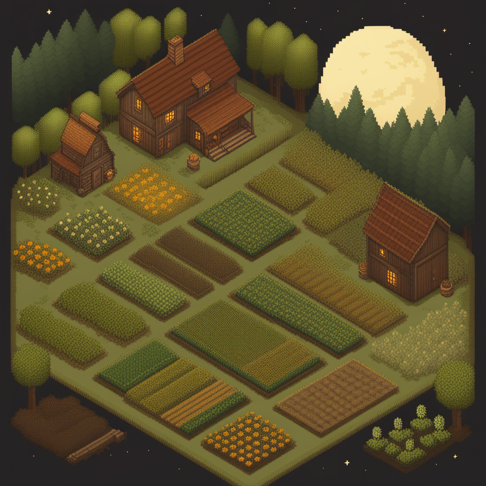
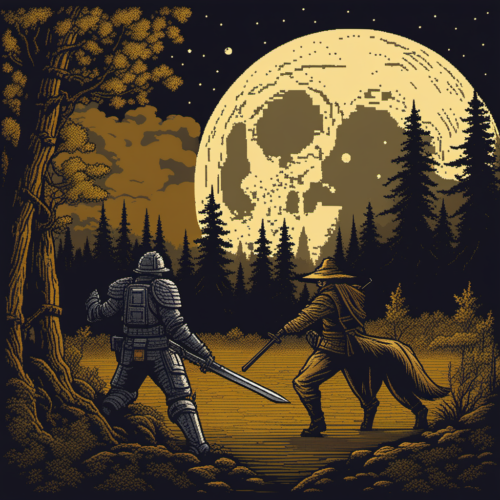
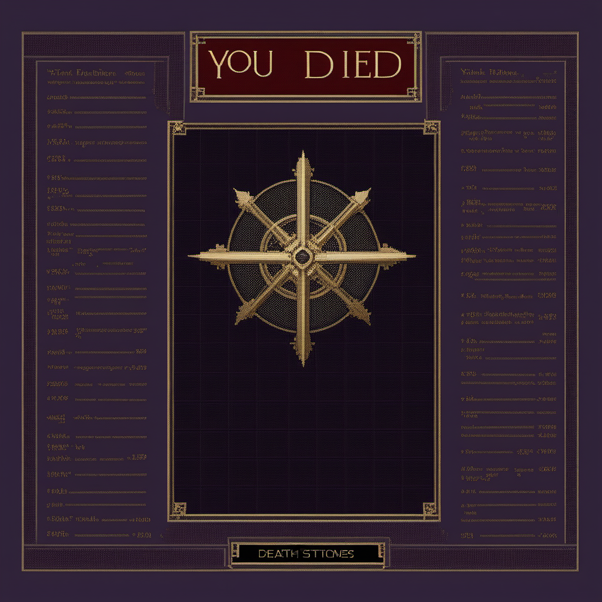

# Moonlit Harvest: Хранитель Грани

**Жанр:** фермерский симулятор + ночной action с тайминг-боем.  
**Core loop:** днём — ферма, NPC, подготовка; ночью — Лунный путь, бои, Лунная пыльца и культуры; прогресс ведёт к Сердцу Луны.  
**Визуальный тон:** pixel art, `#191c21` + `#ffa800` / `#88ccff`, контраст «уют ↔ риск».

## Быстрая навигация

| Документ | Назначение |
|----------|------------|
| [GDD.md](GDD.md) | Полный дизайн-документ |
| [final.md](final.md) | Как воспроизвести пайплайн + ссылки |
| [reports/2026-05-28-midterm.md](reports/2026-05-28-midterm.md) | Отчёт к midterm |
| [logs/workflow-notes.md](logs/workflow-notes.md) | Параметры генераций, выводы |
| [logs/gdd-log.md](logs/gdd-log.md) | Итерации GDD с LLM |
| [style/Style-bible.md](style/Style-bible.md) | Стиль, baseline, reference rules |
| [shots/shot-list.md](shots/shot-list.md) | Скрингены и control plan |
| [workflows/](workflows/) | ComfyUI JSON (W04–W09) |

---

## Три скриншота геймплея (скрингены)

### Скринген 01 — Утро на ферме (меню / дневной режим)

Изометрическая ферма, дом, лес на горизонте, бледная Луна — показывает дневной ритм и USP «уют с намёком на тайну». Текст логотипа — постобработка в Aseprite.

### Скринген 02 — Лунный танец (бой)

Ночной лес, уклонение от тени, золотая вспышка `#ffa800` — демонстрирует ночную боевую механику и палитру. Доработка: `outputs/selected/02-w07-img2img-after.png` (img2img denoise 0.5).

### Скринген 03 — Тьма победила (экран смерти)

Rogue-lite ставка: потеря 50% Лунной пыльцы. UI-текст планируется вручную; inpaint/outpaint: `outputs/selected/04-w07-inpaint-after.png`, `05-w07-outpaint-after.png`.

**Доп. кадр (босс, SH04):** [images/selected/04_moon_lord_boss_seed42424242.png](images/selected/04_moon_lord_boss_seed42424242.png) → upscale: [outputs/selected/09-moon-lord-upscale-after.png](outputs/selected/09-moon-lord-upscale-after.png)

---

## Midterm selected (12 файлов для проверки)

Полный список с ролями: [outputs/selected/README.md](outputs/selected/README.md).

| # | Файл | Что это |
|---|------|---------|
| 01 | `outputs/selected/01-w06-hero-base.png` | Герой Элиан — baseline |
| 02 | `outputs/selected/02-w06-hero-emotion.png` | Вариация: эмоция |
| 03 | `outputs/selected/03-w06-hero-shot.png` | Вариация: ракурс 3/4 |
| 04 | `images/selected/01_hub_seed42424242.png` | Скринген: ферма / меню |
| 05 | `images/selected/02_combat_seed42424242.png` | Скринген: бой |
| 06 | `images/selected/03_death_screen_seed42424242.png` | Скринген: смерть |
| 07 | `images/selected/04_moon_lord_boss_seed42424242.png` | Скринген: босс |
| 08 | `images/selected/05_legendary_item_HotM_seed42424242.png` | Артефакт / UI-иконка |
| 09 | `outputs/selected/07-w05-style-baseline-01.png` | Утверждённый стиль A+B |
| 10 | `outputs/selected/08-depth-scene-01.png` | ControlNet Depth — ночная сцена |
| 11 | `outputs/selected/02-w07-img2img-after.png` | Img2img: чистка боя |
| 12 | `outputs/selected/09-moon-lord-upscale-after.png` | Upscale босса (W09) |

Остальные PNG в `outputs/selected/` и `images/selected/` — черновики A/B и промежуточные прогоны (не входят в лимит midterm).

---

## Три ключевых workflow

| Workflow | Назначение |
|----------|------------|
| [w04_sdxl_txt2img.json](workflows/w04_sdxl_txt2img.json) | Базовая генерация ассетов и скрингенов (SDXL, seed 42424242+) |
| [w07_img2img_inpaint_outpaint.json](workflows/w07_img2img_inpaint_outpaint.json) | Правки кадров: denoise / маска / расширение холста |
| [w08_controlnet_depth_canny.json](workflows/w08_controlnet_depth_canny.json) | Контроль глубины и контуров под сцены и UI |

Дополнительно: `w06_multiprompt.json` (серия героя), `w09_simple_upscale_sdxl.json` (апскейл selected).

---

## Статус

**Midterm:** упаковка готова — [отчёт](reports/2026-05-28-midterm.md), 12 selected, 3 скриншена в этом файле.

**До final (генерации в ComfyUI):** дневной герой, canny-локация, outpaint SH04 — [logs/comfyui-missing-assets-guide.md](logs/comfyui-missing-assets-guide.md).
